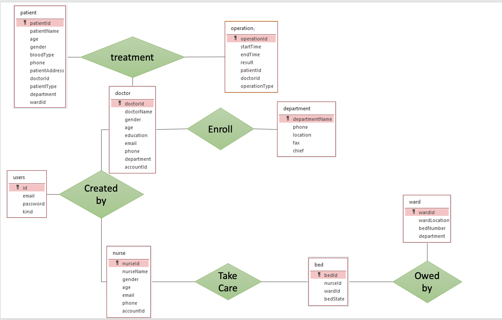
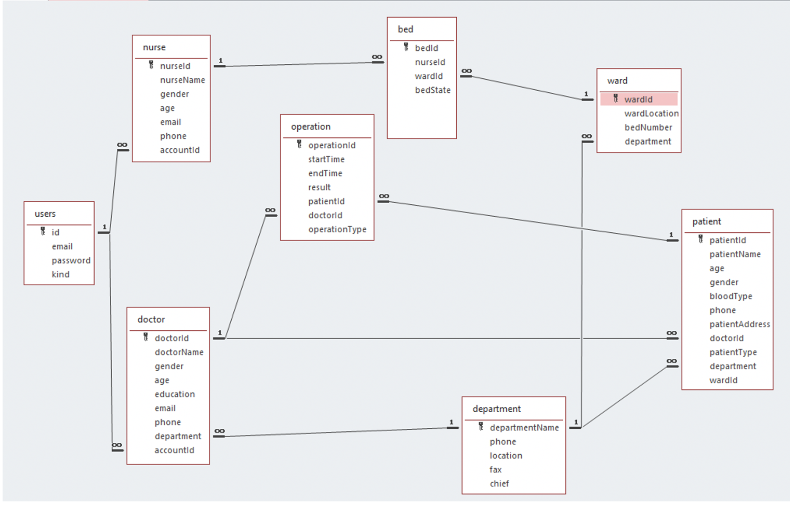

# Hospital Backend Server

- NodeJS API backend server With hostpial frontend UI

## Content
- [Folder Structure](#folder-structure)
- [Requirements](#requirements)
- [Setup](#setup)
- [Usages](#usages)
- [TODO](#todo)
- [Entity Diagram](#entity-diagram)

### Requirements

- `NodeJS 10+`
- `NPM 6+` (Node Package Manager - *comes with NodeJS Installation*)
- `MariaDB` - *latest*
- Browser - `Chrome Latest`

### Setup
- Run SQL file in `startup` folder
- Run `npm install` in root folder
- Change MariaDB options in the file `config/keys/db.connector.js` [user, host, password]
- `node index.js` to **startup server**
    - Server Starts at **http://localhost:8080**
    - Open **http://localhost:8080** in the browser (Chrome Latest)
    - Login using one of the credentials in SQL file

### Usages

- Create, Update, List Doctors, Nurses, Wards, Departments, Patients, Operations, Beds
- Create and List Users
- Users can login using password and email.
- Doctors, Nurses can be associated with Users table for login

### Sample

- [Sample UI Video](./sample/ui.mp4)
    - `sample/ui.mp4`

### Entity Diagram




### Folder Structure
```bash
.
├── README.md
├── api
│   ├── appointment
│   │   ├── appoinment.controller.js
│   │   └── index.js
│   ├── bed
│   │   ├── bed.controller.js
│   │   └── index.js
│   ├── department
│   │   ├── department.controller.js
│   │   └── index.js
│   ├── doctor
│   │   ├── doctor.controller.js
│   │   └── index.js
│   ├── nurse
│   │   ├── index.js
│   │   └── nurse.controller.js
│   ├── operation
│   │   ├── index.js
│   │   └── operation.controller.js
│   ├── patient
│   │   ├── index.js
│   │   └── patient.controller.js
│   ├── user
│   │   ├── index.js
│   │   └── user.controller.js
│   └── ward
│       ├── index.js
│       └── ward.controller.js
├── app.js
├── auth
│   ├── auth.service.js
│   ├── index.js
│   └── local
│       ├── index.js
│       └── passport.js
├── client
│   ├── 3rdpartylicenses.txt
│   ├── favicon.ico
│   ├── index.html
│   ├── main-es2015.40020cdeee05ac46a9b1.js
│   ├── main-es2015.40020cdeee05ac46a9b1.js.LICENSE.txt
│   ├── main-es5.40020cdeee05ac46a9b1.js
│   ├── polyfills-es2015.ffa9bb4e015925544f91.js
│   ├── polyfills-es2015.ffa9bb4e015925544f91.js.LICENSE.txt
│   ├── polyfills-es5-es2015.44547b4d4a23c72d0f9c.js.LICENSE.txt
│   ├── polyfills-es5.44547b4d4a23c72d0f9c.js
│   ├── runtime-es2015.cdfb0ddb511f65fdc0a0.js
│   ├── runtime-es5.cdfb0ddb511f65fdc0a0.js
│   └── styles.dc0a6d1e19b8323d8d3d.css
├── config
│   ├── db.connector.js
│   ├── environment.js
│   ├── express.js
│   └── keys
│       ├── test-key
│       ├── test-key.pem
│       └── test-key.pub
├── development.md
├── index.js
├── package-lock.json
├── package.json
├── routes.js
└── startup
    ├── New Microsoft PowerPoint Presentation.pptx
    ├── New Microsoft Word Document.docx
    ├── hs.sql
    └── project1.accdb
```

### TODO
- Better Error Message for UI
- Reset Password for User
- Add deletion functionality where make sense

# Development Notes

- [Development Notes](development.md)